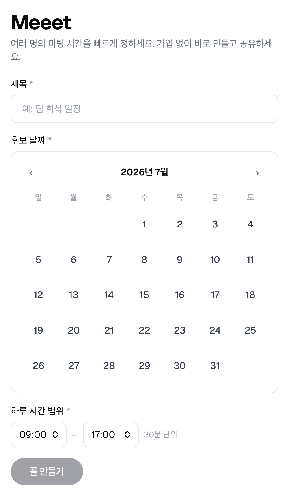
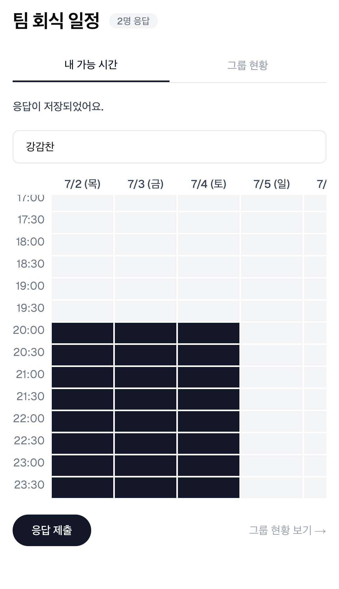
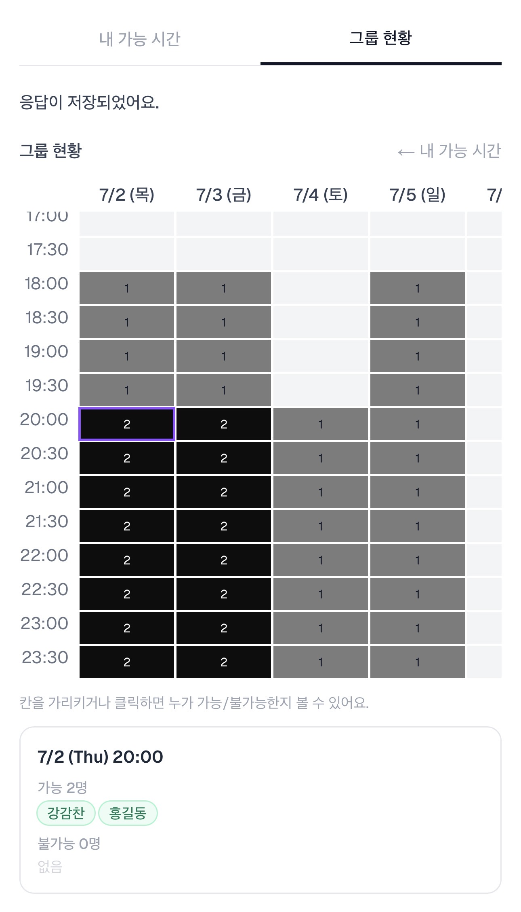

# Meeet

로그인 없이 미팅 시간을 빠르게 정하는 도구. When2meet / Doodle 방식.

**[meeet-sable.vercel.app](https://meeet-sable.vercel.app)**

---

## 화면

<table>
  <tr>
    <td align="center"><b>폴 생성</b></td>
    <td align="center"><b>내 가능 시간</b></td>
    <td align="center"><b>그룹 현황</b></td>
  </tr>
  <tr>
    <td></td>
    <td></td>
    <td></td>
  </tr>
</table>

---

## 어떻게 동작하나요

1. **폴 생성** — 후보 날짜들과 하루 시간 범위를 고르면 서버가 30분 격자 슬롯을 만든다
2. **링크 공유** — 추측 불가능한 공개 토큰 링크를 참가자들에게 공유
3. **응답 수집** — 참가자는 이름만 입력하고 격자를 칠해(모바일 탭 · 데스크톱 드래그) 가능 시간을 표시
4. **히트맵 확인** — 칸마다 가능 인원이 진해지는 히트맵으로 최적 시간 파악
5. **자동 만료** — 마지막 후보 날짜가 지나면 폴이 자동으로 만료·삭제

계정/로그인 없음. 링크를 아는 것 자체가 접근 권한.

---

## 기술 스택

| 영역 | 기술 |
|---|---|
| 프레임워크 | Next.js 15 (App Router), React 19, TypeScript |
| 스타일 | Tailwind CSS 4 |
| DB / ORM | Neon Postgres, Drizzle ORM |
| 검증 | Zod |
| 테스트 | Jest, React Testing Library |
| 배포 | Vercel |

---

## 로컬 개발

```bash
# 1. 환경변수 설정
cp .env.example .env.local

# 2. 로컬 Postgres 컨테이너 실행 (포트 5434)
docker compose up -d

# 3. 의존성 설치 및 마이그레이션
npm install
npm run db:migrate

# 4. 개발 서버 시작
npm run dev
```

`http://localhost:3000` 에서 확인.

---

## 브랜치 전략

```
main   →  Vercel Production  (meeet-sable.vercel.app)
dev    →  Vercel Preview      (자동 생성 URL)
feat/* →  PR Preview          (PR마다 자동 생성 URL)
```

**워크플로우**

```bash
git checkout dev
git checkout -b feat/my-feature

# 작업 후 PR: feat/* → dev → main
```

- `main`에 푸시되면 Vercel이 자동으로 Production 배포
- `dev` 및 `feat/*` 브랜치는 PR마다 독립 Preview URL 생성

---

## DB 마이그레이션

| 환경 | DB | 마이그레이션 방법 |
|---|---|---|
| 로컬 | Docker Postgres (localhost:5434) | `npm run db:migrate` |
| Production / Preview | Neon (Vercel 연동) | Neon SQL Editor에서 직접 실행 |

스키마 변경 시:
```bash
# 1. 마이그레이션 파일 생성
npm run db:generate

# 2. 로컬 적용
npm run db:migrate

# 3. Neon Production에는 drizzle/ 폴더의 SQL을 Neon SQL Editor에서 실행
```

---

## 명령어

| 명령 | 설명 |
|---|---|
| `npm run dev` | 개발 서버 |
| `npm run build` | 프로덕션 빌드 |
| `npm run lint` | ESLint |
| `npm run test` | Jest |
| `npm run db:generate` | 스키마 변경으로부터 마이그레이션 생성 |
| `npm run db:migrate` | 마이그레이션 적용 |
| `npm run db:studio` | Drizzle Studio |

---

## 개발 방식

이 프로젝트는 SDD(Spec-Driven Development)로 개발한다.
새 기능은 `specs/` 디렉토리에 spec → plan → tasks 순으로 문서를 작성한 뒤 구현한다.
자세한 워크플로우는 [AGENTS.md](./AGENTS.md) 참고.
