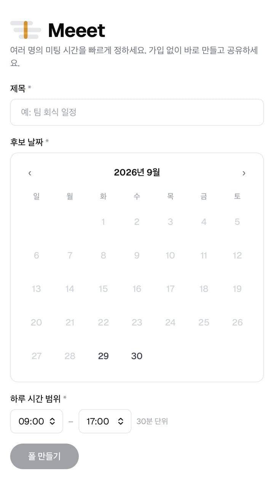
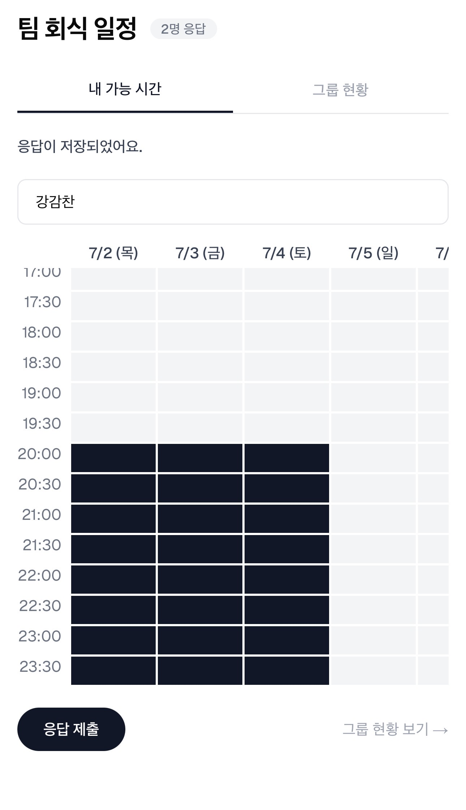
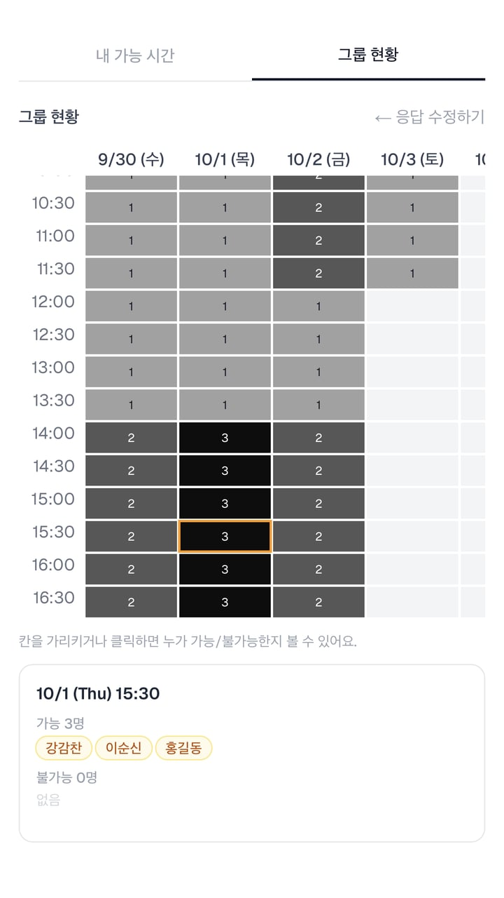

# Meeet

여러 사람과 만날 시간을 정할 때, 카톡방에서 "언제 되세요?"를 반복하지 않아도 됩니다.
후보 날짜만 고르면 링크가 하나 생기고, 참가자들은 그 링크에서 가능한 시간을 칠하기만
하면 됩니다. 회원가입도, 로그인도 없습니다.

**[meeet-sable.vercel.app](https://meeet-sable.vercel.app)** 에서 바로 사용해보세요.

---

## 화면

<table>
  <tr>
    <td align="center"><b>폴 생성</b></td>
    <td align="center"><b>내 가능 시간</b></td>
    <td align="center"><b>그룹 현황</b></td>
  </tr>
  <tr>
    <td></td>
    <td></td>
    <td></td>
  </tr>
</table>

---

## 이렇게 사용하세요

1. **폴 만들기** — 만나고 싶은 후보 날짜들과 하루 중 가능한 시간 범위를 고르면, 30분 단위 격자가 자동으로 만들어져요
2. **링크 공유** — 생성된 링크를 참가자들에게 카톡이나 메일로 공유하면 끝
3. **가능한 시간 표시** — 참가자는 이름만 입력하고, 격자에서 가능한 시간을 칠하면 돼요 (모바일은 탭, 데스크톱은 드래그)
4. **한눈에 확인** — 칸마다 가능한 인원 수만큼 진해지는 히트맵으로 다 같이 되는 시간을 바로 찾을 수 있어요
5. **자동 정리** — 마지막 후보 날짜가 지나면 폴은 자동으로 사라져요

가입도 로그인도 필요 없습니다. 링크를 아는 사람이라면 누구나 보고 참여할 수 있어요.
